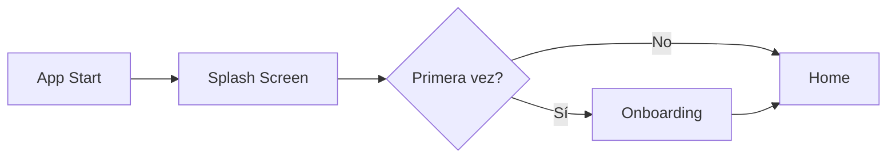

# 🎨 Guía Visual - Splash Screen y Onboarding

## 📱 Splash Screen Implementada

### Características visuales:
```
┌─────────────────────────────────┐
│                                 │
│         Gradiente               │
│      (Primary Color)            │
│                                 │
│         ┌─────────┐            │
│         │  LOGO   │            │
│         │         │            │
│         └─────────┘            │
│                                 │
│      BarberMusic               │
│         & Spa                  │
│                                 │
│          ◯ ◯ ◯                │
│                                 │
│  Preparando tu experiencia...  │
│                                 │
└─────────────────────────────────┘
```

### Animaciones:
- **Logo**: Scale (0.3 → 1.0) + Fade In
- **Título**: Slide Y + Fade In (delay: 500ms)
- **Subtítulo**: Slide Y + Fade In (delay: 700ms)
- **Loading**: Scale + Fade In (delay: 1000ms)

## 📖 Onboarding (4 Páginas)

### Página 1 - Reserva con Facilidad
```
┌─────────────────────────────────┐
│                                 │
│         ╔═══════════╗          │
│         ║    📅     ║          │
│         ║ Calendario ║          │
│         ╚═══════════╝          │
│                                 │
│    Reserva con Facilidad       │
│                                 │
│  Programa tus citas de         │
│  barbería y spa en segundos    │
│                                 │
│  ○ ● ○ ○                       │
│                                 │
│  [Omitir]        [Siguiente]   │
└─────────────────────────────────┘
```

### Página 2 - Productos Premium
```
┌─────────────────────────────────┐
│                                 │
│         ╔═══════════╗          │
│         ║    🛍️     ║          │
│         ║ Shopping  ║          │
│         ╚═══════════╝          │
│                                 │
│     Productos Premium          │
│                                 │
│  Explora nuestra exclusiva     │
│  colección de productos        │
│                                 │
│  ○ ○ ● ○                       │
│                                 │
│  [Omitir]        [Siguiente]   │
└─────────────────────────────────┘
```

### Página 3 - Múltiples Sucursales
```
┌─────────────────────────────────┐
│                                 │
│         ╔═══════════╗          │
│         ║    📍     ║          │
│         ║ Location  ║          │
│         ╚═══════════╝          │
│                                 │
│    Múltiples Sucursales        │
│                                 │
│  Encuentra la sucursal más     │
│  cercana a ti                  │
│                                 │
│  ○ ○ ○ ●                       │
│                                 │
│  [Omitir]        [Siguiente]   │
└─────────────────────────────────┘
```

### Página 4 - Experiencia Premium
```
┌─────────────────────────────────┐
│                                 │
│         ╔═══════════╗          │
│         ║    💳     ║          │
│         ║  Pagos    ║          │
│         ╚═══════════╝          │
│                                 │
│     Experiencia Premium        │
│                                 │
│  Disfruta de un servicio de    │
│  primera clase                 │
│                                 │
│  ○ ○ ○ ○                       │
│                                 │
│  [Omitir]         [Comenzar]   │
└─────────────────────────────────┘
```

## 🎨 Paleta de Colores

| Página | Color | Hex |
|--------|-------|-----|
| Reservas | Azul | #4A90E2 |
| Productos | Naranja | #E27D4A |
| Ubicaciones | Verde | #50C878 |
| Premium | Morado | #9B59B6 |

## 🔧 Cómo Personalizar

### 1. Cambiar el logo:
- Reemplaza `assets/logo.png` con tu nuevo logo

### 2. Modificar colores:
- En `splash_screen.dart`: Cambia los colores del gradiente
- En `onboarding_screen.dart`: Modifica los colores en `_pages`

### 3. Agregar más páginas:
- Agrega nuevos elementos al array `_pages`
- Cada página necesita: title, description, imagePath, color

### 4. Cambiar animaciones:
- Modifica las duraciones en `.animate()`
- Ajusta las curvas de animación
- Cambia los delays para secuencias diferentes

## 📱 Flujo de Usuario



## 🚀 Próximos Pasos

1. **Agregar imágenes reales** en lugar de iconos
2. **Implementar skip permanente** con opción en settings
3. **Añadir animaciones Lottie** para más dinamismo
4. **Localización** para múltiples idiomas
5. **A/B Testing** de diferentes flujos de onboarding
